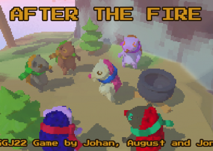

# After the Fire

Made during Global Game Jam 2022 with the theme: Duality.

You can play it here: https://augustalex.itch.io/after-the-fire

## Credits:
Johan  - Game Artist:  https://johanhandin.com/

August - Programmer and Designer: https://augustalex.itch.io/

Jonas - Sound, VFX, Programmer, Composer, Stressed: https://www.instagram.com/jonassandstedt/?hl=en

## Game description

OH NO, you have accidentally put the forest on fire in the preparation for your BIG party!!!! Now you need to save your hedgehog friends by putting out the fires and collect pinecones to regrow the forest. Maybe you can find some tasty beetles to make your famous beelte stew. Press E to Roll or Unroll. Press SHIFT to collect snow and grow your snowball. Roll on trees to collect pinecones. Roll on fire to put it out. Talk to your friends the regrow the forest. The game is about duality: Fire and Ice Destruction and Healing You are both the villian and the hero.

## Building and developing

Make sure you have Unity 2020.3.26f1 installed, clone this project, and open it with Unity.
